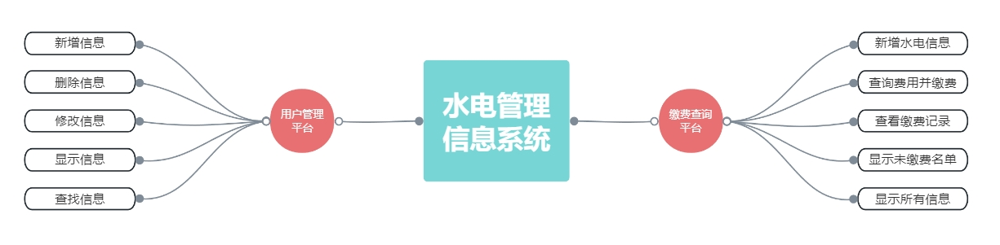
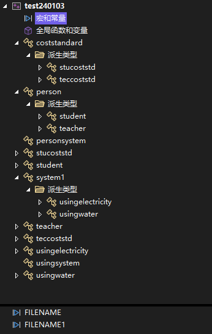

# 水电管理信息系统 👀

## 🎇 简介

设计一个水电管理信息系统，能够对高校的水电费用进行管理,包括了**登记费用**，**查询费用**，以及**住户信息管理**等。在设计时要考虑到学生和教工在用水电时的不同，学生可以免费使用一定额度的水电，超过这个额度的随便以后必须自费使用，且自费部分水电费的价格标准要高于教工的收费标准（~~主要是节约资源~~）。

## ⭐ 基本要求
1. 实现对用户信息的录入
2. 实现水电煤气数据的录入
3. 计算并查询用户应缴费用
4. 查询未缴纳费用名单

##  🔧 测试数据

可选用小区物业管理部门的数据，也可采用手工输入不少于 10 个用户信息的数据。
实现提示:

1. 用户基本信息类，教工用户信息类，学生用户信息类
2. 收费标准类，该类存储水电煤气标准单位的收费标准，如：煤气，1.0 元/立方米；
3. 不同类型人员水、电、煤气信息类，这些类可以包括水表，电表，煤气表 ID,抄表时间，上次抄表时间，本次抄表时间，上次抄表度数，本次抄表度数，本次使用度数，费用，是否缴费标记等信息。
4. 在实现的时候考虑继承和多态技术的合理使用。

## 🤔 选做内容

实现用户查询系统能够找出该用户半年之内的交费记录和本次应交费的数据

# 😊 项目介绍

## 💻 运行与使用

使用 **Visual Studio** 打开 `test240103.sln` 启动整个解决方案，点击运行即可运行整个系统。

## 🔍 类视图

- **`mDELTA`** is an algorithm for **m**ultifuricating **D**evelopmental c**E**ll **L**ineage **T**ree **A**lignment. In essence, it compares two rooted, unordered, tip-labeled trees, and finds the best global ｜ local correspondence between the nodes. The **mDELTA** program is designed for analyzing developmental cell lineage trees
  reconstructed through single-cell DNA barcoding (such as done by
  **`scGESTALT`** or **`SMALT`**, while greater cellular coverage is expected to
  yield more meaningful **mDELTA** alignments).

- Except for dealing with cell lineage trees instead of biological
  sequences, **mDELTA** is conceptually similar to sequence alignment.
  It helps quantify similarity among different lineage trees,
  disentangle the consensus and variation, find recurrent motifs, and
  facilitate comparative/evolutionary analyses.

## 🚗部分功能介绍与特点

