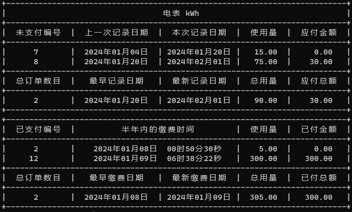

# 水电管理信息系统 👀


## 🎇 简介

设计一个水电管理信息系统，能够对高校的水电费用进行管理,包括了**登记费用**，**查询费用**，以及**住户信息管理**等。在设计时要考虑到学生和教工在用水电时的不同，学生可以免费使用一定额度的水电，超过这个额度的随便以后必须自费使用，且自费部分水电费的价格标准要高于教工的收费标准（~~主要是节约资源~~）。

## ⭐ 基本要求
1. 实现对用户信息的录入
2. 实现水电煤气数据的录入
3. 计算并查询用户应缴费用
4. 查询未缴纳费用名单


##  🔧 测试数据

可选用小区物业管理部门的数据，也可采用手工输入不少于 10 个用户信息的数据。
实现提示:

1. 用户基本信息类，教工用户信息类，学生用户信息类
2. 收费标准类，该类存储水电煤气标准单位的收费标准，如：煤气，1.0 元/立方米；
3. 不同类型人员水、电、煤气信息类，这些类可以包括水表，电表，煤气表 ID,抄表时间，上次抄表时间，本次抄表时间，上次抄表度数，本次抄表度数，本次使用度数，费用，是否缴费标记等信息。
4. 在实现的时候考虑继承和多态技术的合理使用。


## 🤔 选做内容

实现用户查询系统能够找出该用户半年之内的交费记录和本次应交费的数据


# 😊 项目介绍

## 💻 运行与使用

使用 **Visual Studio** 打开 `test240103.sln` 启动整个解决方案，点击运行即可运行整个系统。


## 🔍 宏与类视图

- **宏定义**
  
  ```c++
  #define FILENAME "persontable.txt"  # 人员信息数据库
  #define FILENAME2 "wetable.txt"     # 水电使用信息数据库
  ```
- **类视图关系**
  
  

## 🚗部分功能介绍与特点

###  v1.0.0

***Recorded on January 1, 2024***

1. 输入格式不正确自动校验，重新输入或者返回当前主菜单

2. 操作与数据库信息热更新，操作完后数据库自动更新。如果操作数据库，系统也能实时更新查看与进一步操作。

3. 订单编号自动生成

4. 自动记录缴费时间

5. 自动获取同一个房间同一种订单类型的上次记录数据，作为上一次记录时间。

6. 缴费选择多样化，可以根据需求，对全部或者对某种类型的订单进行 ”全部，部分订单号“ 进行缴费，自动获取应付金额

7. 查看缴费记录，可以获取所有缴费记录，可以选择半年内的缴费记录和本次缴费数据

   

8. 查看未缴费名单，按照房间号升序排序输出所有人信息，并统计每个房间号应缴费金额

------

### 
